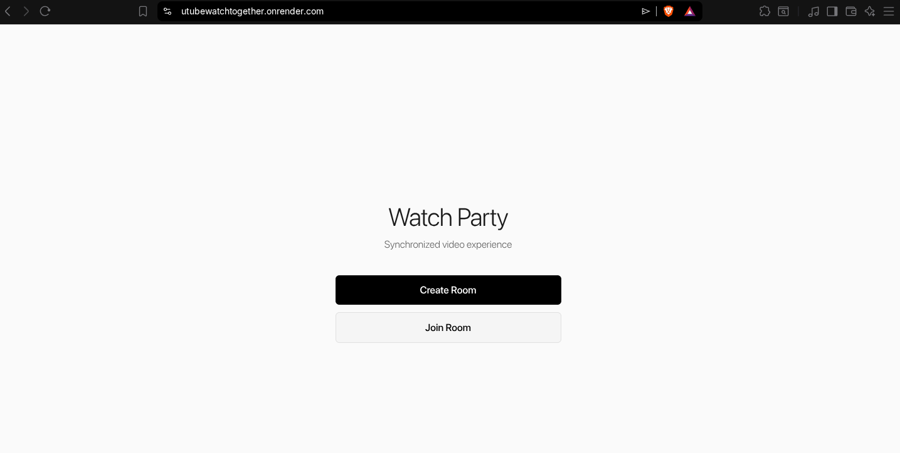
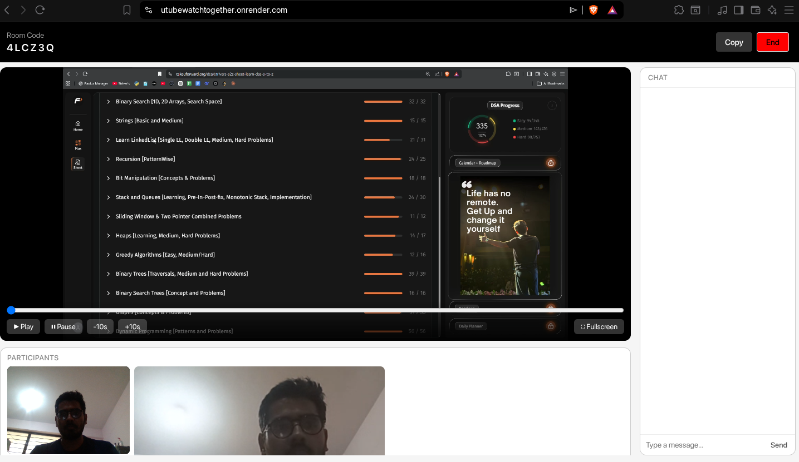

# UtubeWatchTogether

A real-time watch party application built with Go, WebSockets, WebRTC, and Redis. Users can create rooms, synchronize video playback, chat in real time, and communicate through peer-to-peer video/audio streams.

> 🚧 This project is actively under development. Contributions, bug reports, and feature suggestions are welcome.
## Features

* Real-time synchronized video playback
* Room creation and joining via room codes
* WebSocket-based state synchronization
* Real-time chat messaging
* WebRTC video/audio communication
* Redis-backed room persistence
* Automatic room cleanup when inactive
* Dockerized deployment with Docker Compose

## Live Demo

https://utubewatchtogether.onrender.com/

## Tech Stack

### Backend

* Go
* Echo
* Gorilla WebSocket
* Redis

### Real-Time Communication

* WebSockets
* WebRTC
* STUN Server

### Deployment

* Docker
* Docker Compose

## Architecture

```text
Browser
   │
   ├── WebSocket ──► Go Server
   │                    │
   │                    └── Redis
   │
   └── WebRTC ◄────► Peer Connections
```

### Components

#### HubManager

Manages all active rooms.

#### Room

Stores room state and connected users.

#### Hub

Handles broadcasts, synchronization, registration, and disconnection events.

#### Redis

Persists room information and enables room recovery after temporary disconnects.

## Running Locally

### Prerequisites

* Docker
* Docker Compose

### Start

```bash
docker-compose up --build
```

Visit:

http://localhost:8080

## Project Structure

```text
cmd/
config/
handlers/
service/
static/
docker-compose.yml
Dockerfile
```
## Synchronization Model

The server maintains the authoritative video state for each room:

- Current playback time
- Play/Pause state
- Last update timestamp

Clients send playback events through WebSockets, and the server broadcasts updates to all connected participants. New users joining a room receive the latest synchronized state.

## Future Improvements

* YouTube URL support
* Host controls
* Screen sharing
* TURN server integration
* Distributed room management
* Recording support

## Learning Outcomes

This project explores:

* Concurrent programming in Go
* WebSocket architectures
* WebRTC signaling
* Redis caching and persistence
* Docker containerization
* Real-time systems design

## Screenshots

### Room Creation


### Watch Party



## Known Limitations

This project is actively being developed and there are several areas that can be improved:

* UI/UX requires further refinement for a smoother watch-party experience.
* WebRTC mesh networking becomes less efficient as participant count increases.
* Reconnection handling can be improved for unstable network conditions.
* Additional testing is needed for edge cases involving simultaneous joins/leaves.
* TURN server support has not yet been added, which may affect connectivity in some network environments.

## Roadmap

### Short Term

* Improve overall UI and responsiveness.
* Fix known synchronization edge cases.
* Improve room rejoin and recovery experience.
* Add better error handling and user feedback.

### Long Term

* Support YouTube URLs directly.
* Integrate TURN servers for improved WebRTC reliability.
* Add analytics and room activity monitoring.
* Explore scalable signaling architecture for larger rooms.

## Contributing

Contributions are welcome.

If you're interested in improving UtubeWatchTogether, feel free to:

* Report bugs and unexpected behavior.
* Suggest new features and improvements.
* Improve the UI/UX.
* Optimize WebRTC and WebSocket performance.
* Improve room persistence and recovery logic.
* Enhance documentation and testing.

### How to Contribute

1. Fork the repository.
2. Create a feature branch.

```bash
git checkout -b feature/my-feature
```

3. Commit your changes.

```bash
git commit -m "Add my feature"
```

4. Push your branch.

```bash
git push origin feature/my-feature
```

5. Open a Pull Request.

Please open an issue before making large architectural changes so we can discuss the approach first.

## Issues and Feedback

If you encounter a bug or have an idea for an improvement, open an issue and include:

* Steps to reproduce
* Expected behavior
* Actual behavior
* Logs or screenshots if applicable

